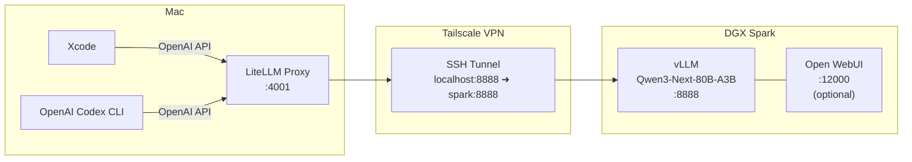
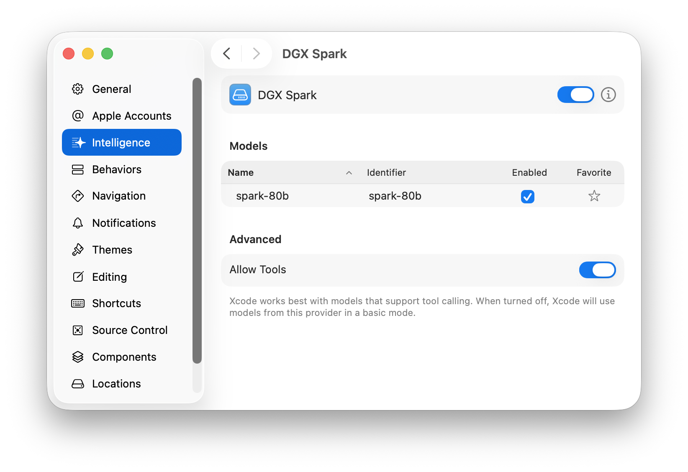
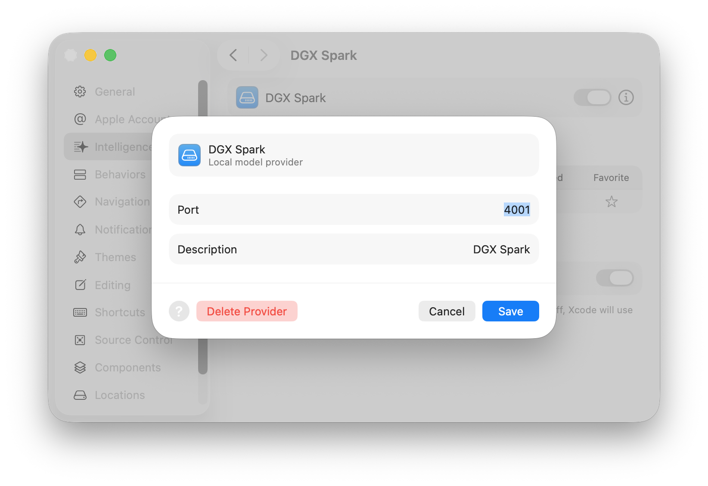

# Playbook: Xcode AI Coding with a Local Model on DGX Spark

## What This Is

This playbook shows how to give Apple Xcode its own private, locally-hosted coding model — no cloud API keys, no usage fees, no data leaving your network.

I am aiming here for a "Pro-Developer" setup which is attempting to get close to the enterprise offerings from Claude or OpenAI.  So my "AI token" server is a Nvidia DGX Spark (a 1 PetaFLOP computer at FP4 precision).  The Spark has 128GB RAM (shared between CPU and GPU) and 4 TB storage, and a 20-core CPU.  It offers the Grace Blackwell (GB10) architecture.

I am also aiming for a enterprise grade delivery model.  Thus I am using a Mesh VPN service (TailScale) and using Docker containerisation to ensure reproducible, isolated deployments.

I've gone some way with system tuning, there is always more to do.  But I am using the famed Nvidia FP4 precision for the model since this is the key strength of the DGX Spark.  This makes my pre-fill phase extremely fast.  It aborbs a prompt very quickly.  The slow part of the architecture is the memory throughput.  This is seen as slow decode phase.  This is the part where the model is generating tokens.
If I had a maximum configuration Mac Studio, I'd see the converse problem: fast decode, but slow pre-fill. 

Xcode speaks the OpenAI Chat Completions protocol for its AI coding features, which means any OpenAI-compatible endpoint will work. We exploit this by running a state-of-the-art open model on an NVIDIA DGX Spark and proxying it with a protocol decoder in the Mac where Xcode runs.

Note the use of port remappings.  Some of these are to avoid conflicts with existing services on the Mac.

### Architecture



**Why each component exists:**

| Component | Role |
|-----------|------|
| **DGX Spark** | Runs the model on GPU. Has enough VRAM to serve an 80B-parameter MoE model at full speed. |
| **vLLM** | High-performance OpenAI-compatible inference server. Handles batching, KV-cache, tool-calling parsing. |
| **Tailscale** | Connects the Mac and DGX Spark over a private mesh VPN, so no ports are exposed to the internet. |
| **SSH tunnel** | Forwards the vLLM port from the DGX Spark to localhost on the Mac, keeping the connection encrypted. |
| **LiteLLM** | A lightweight proxy on the Mac that translates between Xcode's expectations and the vLLM backend. Provides the Responses API and model aliasing. |
| **Open WebUI** | Optional. Gives you a ChatGPT-style browser UI for the same model — handy for testing and ad-hoc questions. |

### The Model

This setup uses **Qwen3-Next-80B-A3B-Instruct-NVFP4** — an 80-billion-parameter Mixture-of-Experts model quantized to NVFP4 precision. It fits in the DGX Spark's GPU memory and provides strong code generation, tool calling, and instruction-following capabilities with a 65,536-token context window.

---

## Prerequisites

- **NVIDIA DGX Spark** (or equivalent GPU server with sufficient VRAM)
- **Mac** running macOS with Xcode installed
- **Tailscale** installed on both machines
- **Docker** with NVIDIA runtime configured on the DGX Spark
- **Python 3** with pip on the Mac
- **Node.js / npm** on the Mac

---

## Step 1: One-Time DGX Spark Setup

### 1.1 Configure Docker for NVIDIA GPUs

On the DGX Spark, ensure Docker knows about the NVIDIA runtime:

```bash
sudo nvidia-ctk runtime configure --runtime=docker
sudo systemctl restart docker
```

Verify with:

```bash
cat /etc/docker/daemon.json
```

You should see:

```json
{
    "runtimes": {
        "nvidia": {
            "args": [],
            "path": "nvidia-container-runtime"
        }
    }
}
```

### 1.2 Connect Tailscale

Visit `https://tailscale.com` to get a free account.  Install the Mac client software (network extensions) and allow it permissions as appropriate.

On both the Mac and the DGX Spark:

```bash
tailscale up
```

Note your DGX Spark's Tailscale IP address — you will need it for SSH configuration.

---

## Step 2: Mac Software Install

Install the LiteLLM proxy and the OpenAI Codex CLI:

```bash
pip install --upgrade pip
pip install 'litellm[proxy]'
```

```bash
npm install -g @openai/codex@0.79.0
```

> **⚠️ Pin Codex to v0.79.0.** Versions after 0.79.0 have a regression that breaks tool calling. Do not use `@latest`.

Tailscale must also be installed as a native macOS app and trusted in **System Settings → Privacy & Security**.

---

## Step 3: SSH Configuration

Add the DGX Spark to your SSH config so you can refer to it by name and automatically forward the necessary ports.

```ssh-config
# ~/.ssh/config

Host dgx-spark
    HostName <YOUR_DGX_SPARK_TAILSCALE_IP>
    User <YOUR_USERNAME>
    # Format — Local:Remote
    LocalForward 8888 127.0.0.1:8888
    LocalForward 12001 127.0.0.1:12000
```

> **Note:** Port 12000 is mapped to 12001 locally because macOS uses port 12000 for AirPlay Receiver.

---

## Step 4: LiteLLM Proxy Configuration

Create the LiteLLM config file on your Mac:

```yaml
# ~/.litellm_config.yaml

model_list:
  - model_name: spark-80b
    litellm_params:
      model: openai/qwen3-next-nvfp4
      api_base: http://localhost:8888/v1
      api_key: sk-1234
      timeout: 600
      stream_timeout: 600

litellm_settings:
  enable_preview_features: true
  request_timeout: 600

general_settings:
  enable_responses_api: true
  response_api_model_map:
    spark-80b: spark-80b
```

---

## Step 5: Environment Variables

Add to your shell profile (`~/.zshrc`):

```bash
export OPENAI_BASE_URL="http://localhost:4001/v1"
export OPENAI_API_KEY="sk-1234"
```

The API key is a dummy value — vLLM does not enforce authentication. LiteLLM needs _something_ set to satisfy the OpenAI client protocol.

---

## Step 6: Launch Sequence

Run these steps in order each time you want to use the setup.

### 6.1 Start Tailscale

```bash
tailscale up
```

### 6.2 Open the SSH Tunnel

Kill any stale tunnels, then start a fresh one:

```bash
pkill -f "ssh -fN dgx-spark"
ssh -fN dgx-spark
```

### 6.3 Start vLLM on the DGX Spark

SSH into the DGX Spark and launch the model server:

```bash
ssh -t dgx-spark "tmux -CC new-session -A -s tmux-main"
```

Then inside the tmux session:

```bash
#!/usr/bin/bash

# Kill old containers
docker rm -f open-webui dgx-vllm-nvfp4 2>/dev/null

# Start vLLM
docker run -d --name dgx-vllm-nvfp4 \
  --network host --gpus all --ipc=host \
  -v "${HOME}/.cache/huggingface:/root/.cache/huggingface" \
  -e MODEL="nvidia/Qwen3-Next-80B-A3B-Instruct-NVFP4" \
  -e PORT=8888 \
  -e GPU_MEMORY_UTIL=0.90 \
  -e MAX_MODEL_LEN=65536 \
  -e MAX_NUM_SEQS=128 \
  -e VLLM_USE_FLASHINFER_MOE_FP4=0 \
  -e VLLM_TEST_FORCE_FP8_MARLIN=1 \
  -e VLLM_NVFP4_GEMM_BACKEND=marlin \
  -e PYTORCH_CUDA_ALLOC_CONF=expandable_segments:True \
  -e VLLM_EXTRA_ARGS="--attention-backend flashinfer --kv-cache-dtype fp8 --served-model-name qwen3-next-nvfp4 --enable-auto-tool-choice --tool-call-parser hermes" \
  avarok/dgx-vllm-nvfp4-kernel:v22 \
  serve

# (Optional) Start Open WebUI for browser-based chat
docker run -d --name open-webui \
  --restart unless-stopped \
  --network host \
  -e PORT=12000 \
  -e OPENAI_API_BASE_URL="http://127.0.0.1:8888/v1" \
  -v open-webui:/app/backend/data \
  ghcr.io/open-webui/open-webui:main
```

> **Startup time:** vLLM takes approximately 10 minutes to load the model into GPU memory. 

Observe its progress on the Spark with 
```bash
docker logs -f dgx-vllm-nvfp4
```

Wait for it to complete before proceeding.  The last line should read:

```
(APIServer pid=1) INFO:     Application startup complete.
```

### 6.4 Start LiteLLM on the Mac

```bash
litellm --config ~/.litellm_config.yaml --port 4001
```

> Port 4001 is used rather than the default 4000 to avoid clashes with other local services.

---

## Step 7: Configure Xcode

In Xcode's settings, configure the AI coding model to use your local endpoint:

| Setting | Value |
|---------|-------|
| **Model endpoint** | `http://localhost:4001/v1` |
| **API key** | `sk-1234` |
| **Model name** | `spark-80b` |

Xcode speaks the OpenAI Chat Completions protocol, so it connects directly to the LiteLLM proxy which handles the rest of the chain.

An example configuration shows


and its port setting is seen as


---

## Pre-Flight Checks

### Verify vLLM is running

```bash
curl http://localhost:8888/v1/models
```

Expected response (abridged):

```json
{
  "object": "list",
  "data": [
    {
      "id": "qwen3-next-nvfp4",
      "object": "model",
      "owned_by": "vllm",
      "root": "nvidia/Qwen3-Next-80B-A3B-Instruct-NVFP4"
    }
  ]
}
```

### Verify LiteLLM proxy is working

```bash
curl http://localhost:4001/v1/models
```

Expected response:

```json
{
  "data": [
    {
      "id": "spark-80b",
      "object": "model",
      "created": 1677610602,
      "owned_by": "openai"
    }
  ],
  "object": "list"
}
```

### Quick inference test

```bash
curl http://localhost:4001/v1/chat/completions \
  -H "Content-Type: application/json" \
  -H "Authorization: Bearer sk-1234" \
  -d '{
    "model": "spark-80b",
    "messages": [{"role": "user", "content": "Write a Swift Hello World program."}]
  }'
```

If you get a Swift code response, the full pipeline is working and Xcode will be able to use the model.

---

## Example Output


---

## Shutting Down

To stop the model and free GPU resources on the DGX Spark:

```bash
docker stop open-webui dgx-vllm-nvfp4
docker container prune -f
sudo nvidia-smi --gpu-reset
```

To tear down the SSH tunnel on the Mac:

```bash
pkill -f "ssh -fN dgx-spark"
```

---

## Troubleshooting

| Symptom | Likely Cause | Fix |
|---------|-------------|-----|
| `curl: (7) Failed to connect to localhost port 8888` | SSH tunnel is down or vLLM hasn't started | Re-run `ssh -fN dgx-spark` and check `docker logs dgx-vllm-nvfp4` |
| LiteLLM returns 500 errors | vLLM is still loading the model | Wait for startup to complete (~10 min), check `docker logs dgx-vllm-nvfp4` |
| Xcode shows "model unavailable" | LiteLLM not running or wrong endpoint in Xcode settings | Verify `curl http://localhost:4001/v1/models` returns the model |
| Port 12000 conflict on Mac | macOS AirPlay Receiver | Already handled — we map to 12001 locally |
| Docker can't access GPU | NVIDIA runtime not configured | Run `sudo nvidia-ctk runtime configure --runtime=docker && sudo systemctl restart docker` |